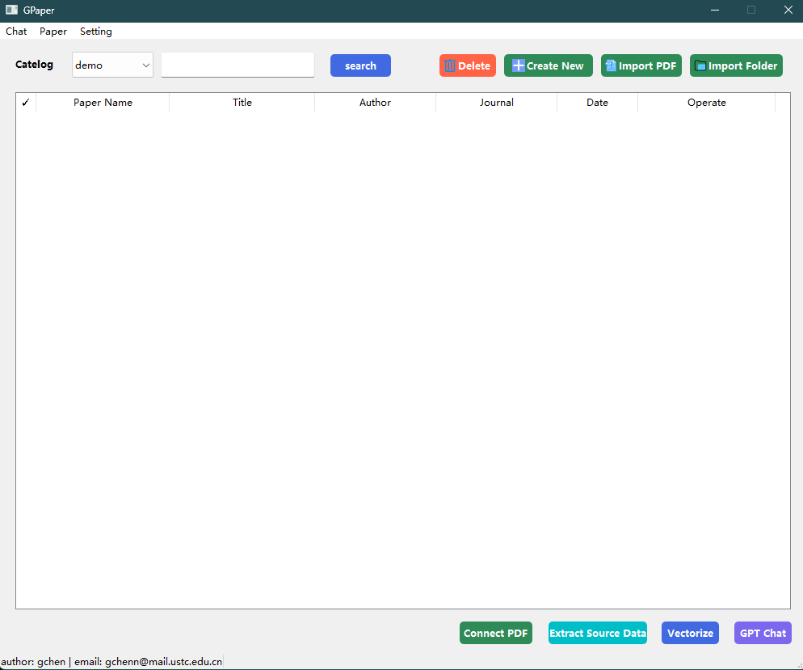
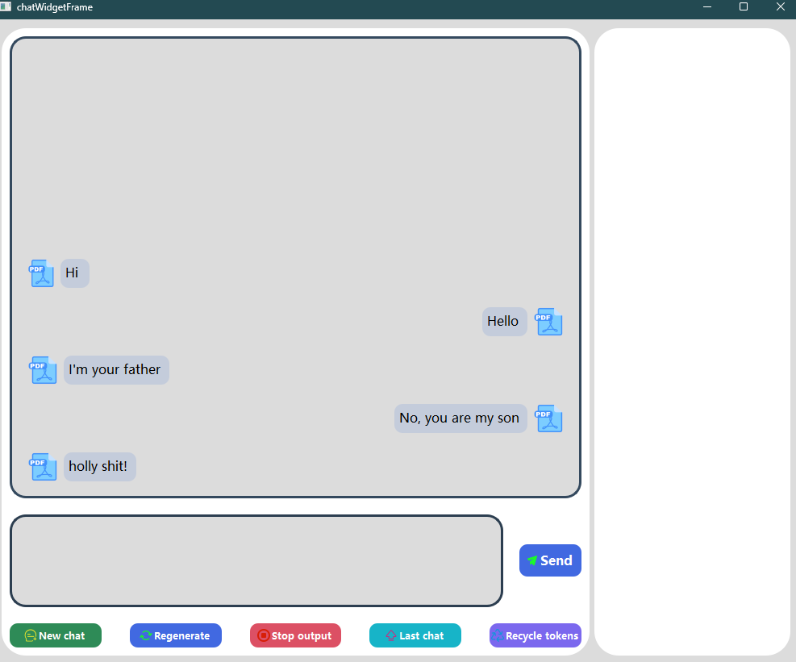
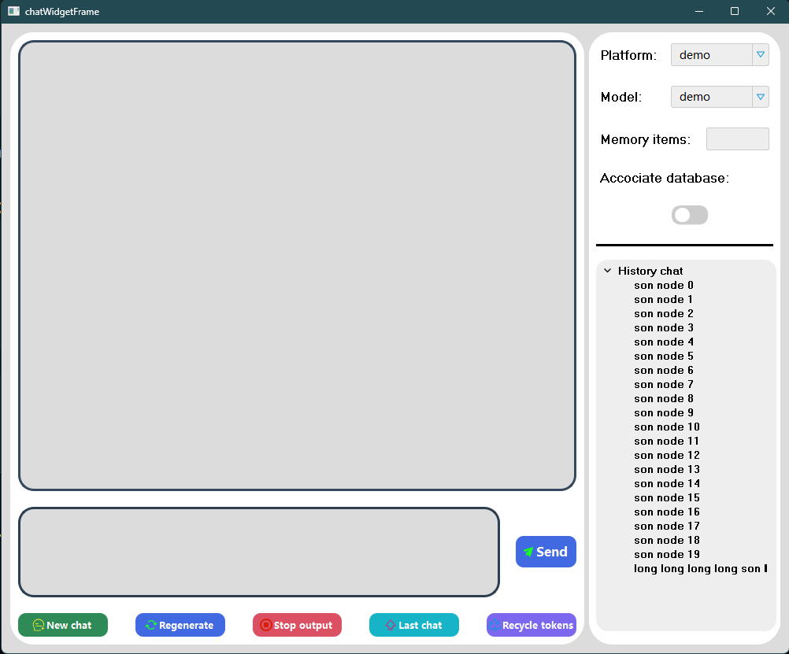
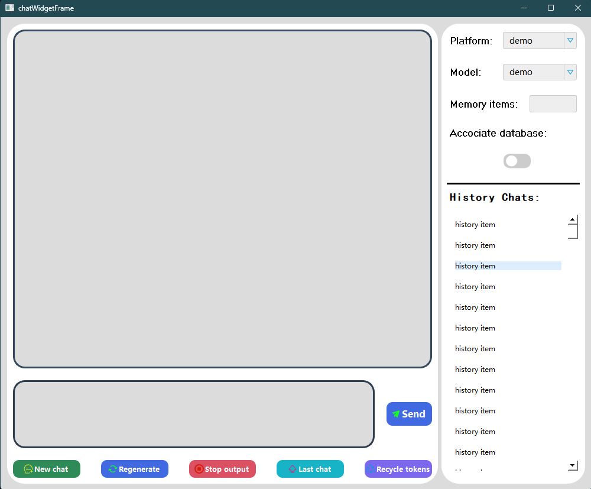

Desc: The project attempts to connect the scientific literature database to GPT, The program will support QIANWEN and CHATGPT. At present, the part of literature database management has been finished, and the part of GPT is still in progress. The project will be implemented using Python and the QianWen and OpenAI API.

## 1. Introduction

The project aims to connect the scientific literature database to GPT, and the program will support QIANWEN and CHATGPT. The project will be implemented using Python and the OpenAI API.

### literature database
1. Import PDF files and extract the text and DOI from the PDF files.
2. Support the extraction of source information from the literature DOI (including author, abstract, journal, publication date, etc.)
3. If the PDF can not extract the DOI, you can fill in manually, and then you can extraction the source information.

### GPT connection
Note that, This part hasn't started yet. But the future plan is following:
1. The program will support QIANWEN and CHATGPT.
2. The program will support the input of the literature information, and then the program will search the related literature.
3. The program will support the input of the literature information, and then the program will return the summary of the literature.
4. The program will support the input of the literature information, and then the program will have the conversation with the user.

## 2. Project Structure
...

## 3. Usage
1. python version >= 3.9
2. pip install -r requirements.txt -i https://pypi.tuna.tsinghua.edu.cn/simple
3. Run main.py directly

## 4. update log
20240301: 
1. Completed part of the chat interface framework
2. Some bugs have been fixed

20240303:
1. Completed the chat interface framework

20240304:
1. Update the history chats' code logic and interface exhibition
